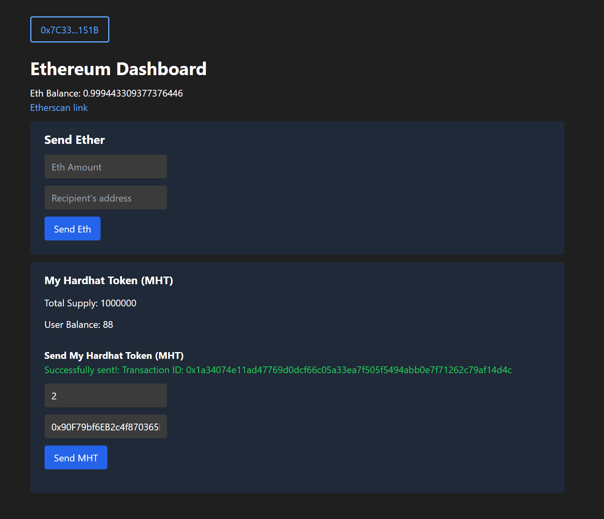

This is a sample web application that allows the user to connect their ethereum wallet via Metamask, and send eth and/or a custom token to another user. Adapted from [https://github.com/NomicFoundation/hardhat-boilerplate](https://github.com/NomicFoundation/hardhat-boilerplate)



This is just a demo and not meant for production use.

### Libraries used:

- ethers.js
- Next.js
- React.js
- Recoil
- TailwindCSS

Created by [Jeremy Bernier](https://github.com/JeremyBernier)

## Instructions

### Smart Contract

In one terminal window run:

```
npx hardhat node
```

In another window run

```
cd contract
npx hardhat run scripts/deploy.ts --network localhost
npx hardhat --network localhost faucet <your_eth_address>
```
### Frontend

Run the development server:

```bash
npm run dev
# or
yarn dev
```

Open [http://localhost:3000](http://localhost:3000) with your browser to see the result.

You can start editing the page by modifying `pages/index.tsx`. The page auto-updates as you edit the file.

[API routes](https://nextjs.org/docs/api-routes/introduction) can be accessed on [http://localhost:3000/api/hello](http://localhost:3000/api/hello). This endpoint can be edited in `pages/api/hello.ts`.

The `pages/api` directory is mapped to `/api/*`. Files in this directory are treated as [API routes](https://nextjs.org/docs/api-routes/introduction) instead of React pages.

## Learn More

To learn more about Next.js, take a look at the following resources:

- [Next.js Documentation](https://nextjs.org/docs) - learn about Next.js features and API.
- [Learn Next.js](https://nextjs.org/learn) - an interactive Next.js tutorial.

You can check out [the Next.js GitHub repository](https://github.com/vercel/next.js/) - your feedback and contributions are welcome!

## Deploy on Vercel

The easiest way to deploy your Next.js app is to use the [Vercel Platform](https://vercel.com/new?utm_medium=default-template&filter=next.js&utm_source=create-next-app&utm_campaign=create-next-app-readme) from the creators of Next.js.

Check out our [Next.js deployment documentation](https://nextjs.org/docs/deployment) for more details.
